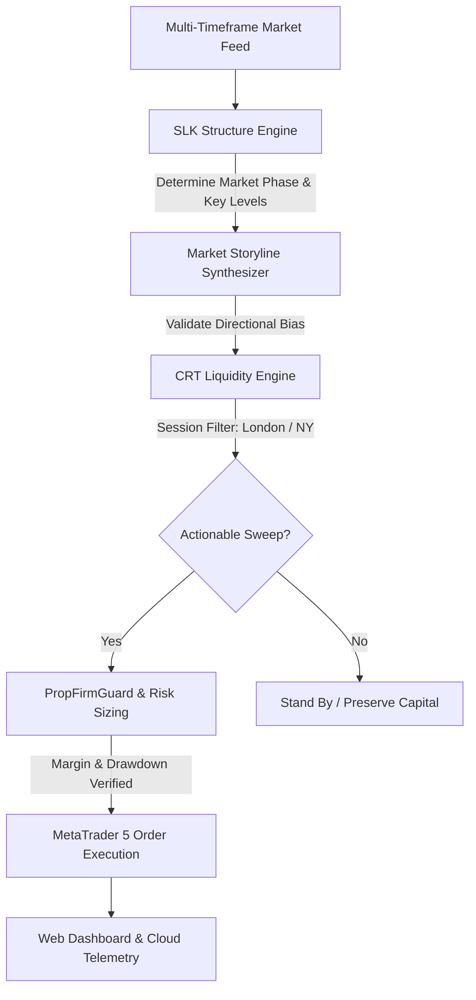

# ForexBot ⚡ Institutional Multi-Timeframe Algorithmic Trading System

ForexBot is an institutional-grade, fully automated algorithmic trading system engineered for **Foreign Exchange (FX)** and **Precious Metals (Gold)**. It transforms advanced discretionary price action theories—specifically **Structure, Liquidity, Key Levels (SLK)** and **Candle Range Theory (CRT)**—into a strictly quantified, emotionless, high-precision execution model.

Built with a capital-preservation-first philosophy, ForexBot is tailored specifically for modern **prop firm compliance** (FTMO, FundedNext, Topstep, etc.) and professional portfolio management, combining multi-timeframe market analysis with institutional risk guardrails and 24/7 cloud telemetry.

---

## 🧭 Why ForexBot?

### The Problem with Conventional Trading Bots
Traditional retail automated trading systems rely heavily on lagging mathematical indicators (RSI, MACD, Moving Average crossovers) or dangerous risk mechanics like Martingale and high-density grid trading. These approaches consistently fail in volatile, regime-shifting markets because they ignore the true underlying drivers of price discovery: **order book liquidity**, **interbank market structure**, and **institutional session timing**.

### The ForexBot Paradigm
ForexBot approaches financial markets through the lens of **institutional order flow**:
- **Price Moves Toward Liquidity**: Price is constantly drawn toward pools of resting buy-side or sell-side liquidity (stop orders and breakout orders).
- **Session-Driven Volatility**: The highest-probability expansions occur during peak market overlap killzones (London and New York sessions).
- **Timeframe Alignment**: Lower-timeframe execution is only valid when confirmed by higher-timeframe market storylines.
- **Asymmetric Risk-to-Reward**: Entries require strictly defined invalidation points with minimum 1:3 to 1:5 risk-to-reward targets.

---

## 🏛️ Strategic Architecture & Trading Engine

ForexBot unifies two complementary trading engines into a seamless decision-making pipeline:

### 1. Structure, Liquidity & Key Levels (SLK) Engine
The SLK Engine constructs the macro narrative before any trade is permitted:
* **Market Environment Classification**: Real-time identification of market state (`UPTREND`, `DOWNTREND`, `RANGING`, or `CHOPPY`) across higher-timeframe structures.
* **Phase Analysis**: Distinguishes between clean trend expansions and institutional accumulation/distribution phases.
* **Imbalance & Breaker Mapping**: Automatically detects institutional Fair Value Gaps (FVG) and structural breaker zones where prior liquidity barriers have been violently violated and retested.

### 2. Candle Range Theory (CRT) Engine
The CRT Engine provides surgical precision for trade timing:
* **Liquidity Purges (Sweeps)**: Flags moments when price aggressively pierces above prior session/candle highs or below prior lows, sweeps resting liquidity, and violently closes back within the previous range.
* **Killzone Synchronization**: Filters trades strictly into the high-volume **London (`07:00 - 12:00 UTC`)** and **New York (`12:00 - 20:00 UTC`)** market windows, eliminating chop outside active sessions.
* **Storyline Confluence**: Only executes if the CRT liquidity sweep aligns directly with the macro SLK directional bias.

---

## 🛡️ Prop Firm Guardrails & Capital Preservation

ForexBot was designed from day one to conquer institutional evaluation challenges and retain funded capital. It enforces strict mathematical safeguards that run continuously at the execution layer:

| Guardrail Feature | Description | Strategic Benefit |
| :--- | :--- | :--- |
| **Daily Drawdown Circuit Breaker** | Locks daily loss to a maximum of **4.5%** against starting balance. | Guarantees compliance with prop firm daily drawdown limits (FTMO 5% rule). |
| **Emergency Position Liquidation** | Automatically closes all open exposures if daily limits are approached. | Prevents runaway black swan slippage or flash crash drawdowns. |
| **Dynamic Margin Auto-Downsizing** | Real-time calculation of broker margin requirements prior to order dispatch. | Prevents margin call rejections and eliminates overleveraging. |
| **Adaptive Order Filling** | Auto-negotiates `FOK`, `IOC`, or `RETURN` filling modes per broker. | Eliminates broker retcode rejections during high-impact market momentum. |
| **Independent Magic Number Tracking** | Distinct identifier (`101202`) isolated from manual discretionary orders. | Allows the bot to run concurrently on accounts with other strategies. |

---

## 📊 Monitored Asset Classes

ForexBot monitors three core assets selected for deep institutional liquidity, predictable session behavior, and tight spreads:

* **EUR/USD (Euro / US Dollar)**: The world’s primary FX pair. Serves as the bedrock liquidity anchor, displaying clean institutional range sweeps during European morning hours.
* **GBP/USD (British Pound / US Dollar)**: Renowned for explosive session displacement and decisive liquidity runs during London and US overlap.
* **XAU/USD (Gold / US Dollar)**: High-beta commodity asset offering extended asymmetric expansions and macro liquidity sweeps across New York trading hours.

---

## ⚙️ Operational Modes

ForexBot is engineered to transition effortlessly across the entire quantitative development lifecycle:

1. **Historical Backtesting Engine**:
   - Zero-lookahead multi-timeframe simulation.
   - Comprehensive performance metrics including Net Profit, Maximum Drawdown, Win Rate, Profit Factor, and Sharpe Ratio.
2. **Paper Trading Simulation Mode**:
   - Real-time live forward testing without financial risk.
   - Replays live market feeds, executes virtual orders, and streams real-time PnL to the web interface.
3. **Live MetaTrader 5 Execution**:
   - Direct low-latency IPC integration with MetaTrader 5 terminals.
   - Native cross-platform support across Windows, Linux VPS (via Wine), and containerized cloud environments.

---

## 📡 Live Telemetry & Observability

ForexBot features a built-in, lightweight web monitoring system requiring zero external databases or third-party monitoring subscriptions:

* **Responsive Status Dashboard**: Instant visual overview of current operational state (`● RUNNING (LIVE)` / `● RUNNING (PAPER)`), account balance, equity, daily drawdown percentage, and active market exposures.
* **Live Activity Log Stream (`/live-log`)**: Browser-accessible streaming terminal log providing minute-by-minute visibility into candle evaluations, session sweeps, and signal triggers.
* **JSON Health API (`/health`)**: Production-ready health check endpoint compatible with uptime monitors, Coolify, Heroku, and alerting services.

---

## ☁️ Cloud & Infrastructure Readiness

ForexBot is fully containerized and cloud-native:
* **Docker & Linux Compatibility**: Runs headlessly in Docker on any Linux VPS (Ubuntu, Debian, Contabo, DigitalOcean, AWS, etc.) using Wine-bridged MetaTrader 5 execution.
* **Container Orchestration**: Pre-configured support for Docker Compose, Coolify, and Heroku.
* **Resilient Auto-Reconnection**: Automatic reconnect handlers safeguard against broker disconnects, network hiccups, and VPS restarts without human intervention.

---

## 📜 Disclaimer & Risk Notice

*Financial trading involves substantial risk of loss and is not suitable for every investor. ForexBot is an algorithmic software tool designed for quantitative research, backtesting, and systematic execution. Past performance in backtesting or simulated environments does not guarantee future results. Users are strongly advised to thoroughly test all configurations on demo accounts before deploying real capital.*

---

## 🤝 Project Credits & Collaboration

* Developed and maintained by the **[BeeSeek Quantitative Engineering Team](https://github.com/beeseek-ng)**.
* **Core Contributors**: Emmanuel Gyimah ([@emdevelopa](https://github.com/emdevelopa)) & Wisdom Divine ([@wisdomnova](https://github.com/wisdomnova)).
* Licensed under the [MIT License](LICENSE).
